# TechProc - Diagrama de Entidad-Relaci�n Completo

## Diagrama ER del Sistema TechProc

```mermaid
erDiagram
    %% ====================================
    %% M�DULO: AUTENTICACI�N Y USUARIOS
    %% ====================================

    User {
        string id PK
        string username UK
        string email UK
        string password_hash
        string role
        string first_name
        string last_name
        string name
        string phone
        string department
        boolean is_active
        timestamp email_verified_at
        timestamp last_login
        string last_login_ip
        timestamp created_at
        timestamp updated_at
        int created_by FK
    }

    PendingRegistration {
        int id PK
        string first_name
        string last_name
        string email UK
        string phone
        string username UK
        string role
        string department
        text reason
        string status
        timestamp submitted_at
        int reviewed_by FK
        timestamp reviewed_at
        text rejection_reason
    }

    UserPermission {
        int id PK
        int user_id FK
        string module
        boolean can_create
        boolean can_read
        boolean can_update
        boolean can_delete
        json custom_permissions
        timestamp created_at
    }

    UserAuditLog {
        int id PK
        int user_id FK
        int changed_by FK
        string action_type
        string field_changed
        string old_value
        string new_value
        text description
        string ip_address
        timestamp created_at
    }

    %% ====================================
    %% M�DULO: LMS (Learning Management System)
    %% ====================================

    Student {
        string id PK
        string first_name
        string last_name
        string email UK
        timestamp email_verified_at
        string address
        date birth_date
        string gender
        string country_location
        string profile_photo
        string role
        string state
        string last_access_ip
        timestamp last_access
        timestamp created_at
        timestamp updated_at
    }

    Instructor {
        string id PK
        string first_name
        string last_name
        string email UK
        timestamp email_verified_at
        string address
        date birth_date
        string gender
        string country_location
        string profile_photo
        string role
        string state
        string bio
        string expertise_area
        string status
        string last_access_ip
        timestamp last_access
        timestamp created_at
        timestamp updated_at
    }

    Course {
        string id PK
        string title
        string code UK
        text description
        string instructor_id FK
        int duration_weeks
        decimal price
        string status
        timestamp created_at
        timestamp updated_at
    }

    CourseContent {
        string id PK
        string course_id FK
        int week
        int session
        string type
        string title
        text content
        int order
        timestamp created_at
    }

    Enrollment {
        string id PK
        string student_id FK
        string course_id FK
        timestamp enrolled_at
        string status
        int progress
    }

    %% ====================================
    %% M�DULO: TICKETS (Sistema de Soporte)
    %% ====================================

    Ticket {
        int ticket_id PK
        int assigned_technician FK
        int user_id FK
        string title
        text description
        string priority
        string status
        timestamp creation_date
        timestamp assignment_date
        timestamp resolution_date
        timestamp close_date
        string category
        text notes
    }

    SupportTechnician {
        int id_technician PK
        int user_id FK
        string specialty
        int assigned_tickets
        int resolved_tickets
        boolean available
        string support_schedule
        string status
        string first_name
        string last_name
        string email
        string profile_photo
    }

    Escalation {
        int escalation_id PK
        int ticket_id FK
        int technician_origin_id FK
        int technician_destination_id FK
        text escalation_reason
        text observations
        timestamp escalation_date
        boolean approved
    }

    TicketTracking {
        int ticket_tracking_id PK
        int ticket_id FK
        text comment
        string action_type
        timestamp follow_up_date
    }

    %% ====================================
    %% M�DULO: SECURITY (Seguridad)
    %% ====================================

    SecurityLog {
        int id_security_log PK
        int user_id FK
        string event_type
        text description
        string source_ip
        timestamp event_date
    }

    SecurityAlert {
        int id_security_alert PK
        int id_blocked_ip FK
        string threat_type
        string severity
        string status
        timestamp detection_date
    }

    Incident {
        int id_incident PK
        int alert_id FK
        int responsible_id FK
        string title
        string status
        timestamp report_date
    }

    BlockedIP {
        int id_blocked_ip PK
        string ip_address UK
        text reason
        timestamp block_date
        boolean active
    }

    ActiveSession {
        int session_id PK
        int user_id FK
        string ip_address
        string device
        timestamp start_date
        boolean active
    }

    SecurityConfiguration {
        int id_security_configuration PK
        int user_id FK
        string modulo
        string parameter
        string value
        boolean active
    }

    Backup {
        int id_backup PK
        int user_id FK
        string type
        string status
        timestamp backup_date
        decimal size_mb
    }

    %% ====================================
    %% M�DULO: INFRASTRUCTURE (Infraestructura)
    %% ====================================

    Server {
        int id_server PK
        string server_name
        string ip_address UK
        string operating_system
        int cpu_cores
        int ram_gb
        int disk_gb
        string status
        string location
        int responsible_id FK
        timestamp installation_date
        timestamp last_maintenance
        json services_running
        decimal cpu_usage_percent
        decimal ram_usage_percent
        decimal disk_usage_percent
        int uptime_hours
    }

    License {
        int id_license PK
        string software_name
        string license_key UK
        string license_type
        string provider
        date purchase_date
        date expiration_date
        int seats_total
        int seats_used
        decimal cost_annual
        string status
        int responsible_id FK
        text notes
    }

    Storage {
        int id_storage PK
        string storage_name
        string storage_type
        decimal capacity_gb
        decimal used_gb
        string location
        int server_id FK
        string mount_point
        boolean backup_enabled
        timestamp last_backup
        string status
    }

    Software {
        int id_software PK
        string software_name
        string version
        string category
        string vendor
        int license_id FK
        timestamp installation_date
        timestamp last_update
        json server_ids
        boolean auto_update
        date support_until
    }

    TechResource {
        int id_resource PK
        string resource_type
        string brand
        string model
        string serial_number UK
        date purchase_date
        date warranty_until
        int assigned_to_user FK
        string status
        string location
        text notes
        decimal cost
    }

    ServerMaintenance {
        int id_maintenance PK
        int server_id FK
        int technician_id FK
        string maintenance_type
        text description
        timestamp scheduled_date
        timestamp completion_date
        string status
        decimal downtime_hours
        text notes
    }

    InfrastructureAlert {
        int id_alert PK
        string alert_type
        string severity
        int resource_id
        string resource_type
        text message
        timestamp detection_date
        boolean resolved
        timestamp resolved_date
        int resolved_by FK
    }

    %% ====================================
    %% M�DULO: WEB (Gesti�n de Contenido)
    %% ====================================

    News {
        int id_news PK
        string title
        string slug UK
        text summary
        text content
        string featured_image
        int author_id FK
        string category
        json tags
        string status
        int views
        timestamp published_date
        timestamp created_date
        timestamp updated_date
        string seo_title
        text seo_description
    }

    Alert {
        int id_alert PK
        text message
        string type
        string status
        string link_url
        string link_text
        timestamp start_date
        timestamp end_date
        int priority
        int created_by FK
        timestamp created_date
    }

    Announcement {
        int id_announcement PK
        string title
        text content
        string image_url
        string display_type
        string target_page
        string link_url
        string button_text
        string status
        timestamp start_date
        timestamp end_date
        int views
        int clicks
        int created_by FK
        timestamp created_date
    }

    ContactForm {
        int id_contact PK
        string full_name
        string email
        string phone
        string company
        string subject
        text message
        string form_type
        string status
        string priority
        int assigned_to FK
        text response
        timestamp response_date
        timestamp submission_date
        string ip_address
        string user_agent
        string utm_source
        string utm_medium
        string utm_campaign
    }

    ChatbotConfig {
        int id_config PK
        string chatbot_name
        text welcome_message
        text fallback_message
        string status
        string language
        string theme_color
        string position
        boolean auto_open
        int auto_open_delay
        boolean working_hours_enabled
        string working_hours_start
        string working_hours_end
        text offline_message
        int updated_by FK
        timestamp updated_date
    }

    ChatbotFAQ {
        int id_faq PK
        text question
        text answer
        string category
        json keywords
        boolean active
        int usage_count
        timestamp created_date
        timestamp updated_date
    }

    ChatbotConversation {
        int id_conversation PK
        string session_id UK
        string user_name
        string user_email
        timestamp started_date
        timestamp ended_date
        int satisfaction_rating
        text feedback
        boolean resolved
        boolean handed_to_human
    }

    ChatbotMessage {
        int id_message PK
        int conversation_id FK
        string sender
        text message
        timestamp timestamp
        int faq_matched FK
    }

    %% ====================================
    %% M�DULO: ANALYTICS (Anal�tica y Reportes)
    %% ====================================

    StudentAttendance {
        int id PK
        int student_id FK
        int course_id FK
        int total_sessions
        int attended_sessions
        int absences
        int tardiness
        int justified_absences
        decimal attendance_percentage
        timestamp last_attendance_date
    }

    StudentProgress {
        int id PK
        int student_id FK
        int course_id FK
        int total_modules
        int completed_modules
        int current_module
        decimal progress_percentage
        decimal average_time_per_module
        date estimated_completion_date
        timestamp enrollment_date
    }

    StudentPerformance {
        int id PK
        int student_id FK
        int course_id FK
        int total_assessments
        int completed_assessments
        decimal average_score
        decimal highest_score
        decimal lowest_score
        decimal passing_rate
        timestamp last_assessment_date
        string grade
    }

    DropoutPrediction {
        int id PK
        int student_id FK
        int course_id FK
        string risk_level
        decimal risk_score
        json factors
        timestamp last_login
        int days_inactive
        json recommended_actions
        timestamp prediction_date
    }

    Report {
        int id_report PK
        string report_name
        string report_type
        text description
        string format
        int generated_by FK
        timestamp generation_date
        string file_path
        decimal file_size_kb
        json parameters
    }

    %% ====================================
    %% RELACIONES - USERS
    %% ====================================

    User ||--o{ User : "creates"
    User ||--o{ PendingRegistration : "reviews"
    User ||--o{ UserPermission : "has"
    User ||--o{ UserAuditLog : "subject_of"
    User ||--o{ UserAuditLog : "performs_audit"

    %% ====================================
    %% RELACIONES - LMS
    %% ====================================

    Instructor ||--o{ Course : "teaches"
    Course ||--o{ CourseContent : "has"
    Course ||--o{ Enrollment : "has"
    Student ||--o{ Enrollment : "enrolls_in"

    %% ====================================
    %% RELACIONES - TICKETS
    %% ====================================

    User ||--o{ Ticket : "creates"
    SupportTechnician ||--o{ Ticket : "assigned_to"
    User ||--|| SupportTechnician : "is"
    Ticket ||--o{ TicketTracking : "tracked_by"
    Ticket ||--o{ Escalation : "escalated"
    SupportTechnician ||--o{ Escalation : "escalates_from"
    SupportTechnician ||--o{ Escalation : "escalates_to"

    %% ====================================
    %% RELACIONES - SECURITY
    %% ====================================

    User ||--o{ SecurityLog : "generates"
    User ||--o{ ActiveSession : "has"
    User ||--o{ SecurityConfiguration : "configures"
    User ||--o{ Backup : "creates"
    BlockedIP ||--o{ SecurityAlert : "triggers"
    SecurityAlert ||--o{ Incident : "creates"
    User ||--o{ Incident : "responsible"

    %% ====================================
    %% RELACIONES - INFRASTRUCTURE
    %% ====================================

    User ||--o{ Server : "responsible"
    Server ||--o{ Storage : "hosts"
    User ||--o{ License : "responsible"
    License ||--o{ Software : "licenses"
    User ||--o{ TechResource : "assigned"
    Server ||--o{ ServerMaintenance : "maintained"
    SupportTechnician ||--o{ ServerMaintenance : "performs"
    User ||--o{ InfrastructureAlert : "resolves"

    %% ====================================
    %% RELACIONES - WEB
    %% ====================================

    User ||--o{ News : "authors"
    User ||--o{ Alert : "creates"
    User ||--o{ Announcement : "creates"
    User ||--o{ ContactForm : "assigned"
    User ||--o{ ChatbotConfig : "updates"
    ChatbotConversation ||--o{ ChatbotMessage : "contains"
    ChatbotFAQ ||--o{ ChatbotMessage : "matched"

    %% ====================================
    %% RELACIONES - ANALYTICS
    %% ====================================

    Student ||--o{ StudentAttendance : "attendance"
    Course ||--o{ StudentAttendance : "tracked"
    Student ||--o{ StudentProgress : "progress"
    Course ||--o{ StudentProgress : "tracked"
    Student ||--o{ StudentPerformance : "performance"
    Course ||--o{ StudentPerformance : "tracked"
    Student ||--o{ DropoutPrediction : "predicted"
    Course ||--o{ DropoutPrediction : "analyzed"
    User ||--o{ Report : "generates"
```



## Resumen de M�dulos

### =� M�dulo LMS (Learning Management System)
- **Entidades**: Student, Instructor, Course, CourseContent, Enrollment
- **Prop�sito**: Gesti�n completa de cursos, estudiantes, instructores y matr�culas

### <� M�dulo Tickets (Sistema de Soporte)
- **Entidades**: Ticket, SupportTechnician, Escalation, TicketTracking
- **Prop�sito**: Sistema de tickets de soporte con escalamiento y seguimiento

### = M�dulo Security (Seguridad)
- **Entidades**: SecurityLog, SecurityAlert, Incident, BlockedIP, ActiveSession, SecurityConfiguration, Backup
- **Prop�sito**: Monitoreo de seguridad, gesti�n de incidentes y backups

### =� M�dulo Infrastructure (Infraestructura TI)
- **Entidades**: Server, License, Storage, Software, TechResource, ServerMaintenance, InfrastructureAlert
- **Prop�sito**: Gesti�n completa de infraestructura tecnol�gica

### < M�dulo Web (Gesti�n de Contenido)
- **Entidades**: News, Alert, Announcement, ContactForm, ChatbotConfig, ChatbotFAQ, ChatbotConversation, ChatbotMessage
- **Prop�sito**: CMS y chatbot para el sitio web corporativo

### =� M�dulo Analytics (Anal�tica y Reportes)
- **Entidades**: StudentAttendance, StudentProgress, StudentPerformance, DropoutPrediction, Report
- **Prop�sito**: Anal�tica avanzada y predicci�n de deserci�n estudiantil

### 👤 Módulo Users (Gestión de Usuarios)
- **Entidades**: User, PendingRegistration, UserPermission, UserAuditLog
- **Propósito**: Gestión completa de usuarios del sistema, aprobación de registros pendientes, control de permisos granular y auditoría de cambios

## Caracter�sticas Profesionales del Dise�o

###  Integridad Referencial
- Todas las relaciones utilizan Foreign Keys (FK)
- Campos �nicos (UK) para evitar duplicados
- Claves primarias (PK) en todas las entidades

###  Escalabilidad
- Dise�o modular que permite crecimiento independiente
- �ndices impl�citos en campos de b�squeda frecuente
- Soft-delete recomendado para auditor�a

###  Seguridad
- Separaci�n de roles y permisos por m�dulo
- Logs de auditor�a en m�ltiples niveles
- Gesti�n de sesiones activas

###  Trazabilidad
- Timestamps en todas las entidades principales
- Sistema de tracking para tickets
- Logs de seguridad completos

###  Anal�tica Avanzada
- Predicci�n de deserci�n estudiantil con ML
- M�tricas de rendimiento y asistencia
- Sistema de reportes flexible

## Notas de Implementaci�n

### Base de Datos Recomendada
- **PostgreSQL 14+** para producci�n
- Soporte para JSON nativo
- Extensiones para Full-Text Search

### �ndices Recomendados
```sql
-- LMS
CREATE INDEX idx_course_instructor ON Course(instructor_id);
CREATE INDEX idx_enrollment_student ON Enrollment(student_id);
CREATE INDEX idx_enrollment_course ON Enrollment(course_id);

-- Tickets
CREATE INDEX idx_ticket_user ON Ticket(user_id);
CREATE INDEX idx_ticket_technician ON Ticket(assigned_technician);
CREATE INDEX idx_ticket_status ON Ticket(status);

-- Security
CREATE INDEX idx_security_log_user ON SecurityLog(user_id);
CREATE INDEX idx_security_log_date ON SecurityLog(event_date);

-- Infrastructure
CREATE INDEX idx_server_responsible ON Server(responsible_id);
CREATE INDEX idx_license_expiration ON License(expiration_date);

-- Web
CREATE INDEX idx_news_author ON News(author_id);
CREATE INDEX idx_news_slug ON News(slug);
CREATE INDEX idx_contact_assigned ON ContactForm(assigned_to);

-- Analytics
CREATE INDEX idx_attendance_student ON StudentAttendance(student_id);
CREATE INDEX idx_performance_student ON StudentPerformance(student_id);
```

### Triggers Recomendados
- Auto-actualizaci�n de `updated_at`
- Validaci�n de progreso 0-100 en enrollments
- Validaci�n de fechas (expiration > purchase)
- Contador autom�tico de vistas en News

---

**Versi�n**: 1.0.0
**Fecha**: 2025-10-04
**Total de Entidades**: 48 entidades principales
**Total de Relaciones**: 50+ relaciones
